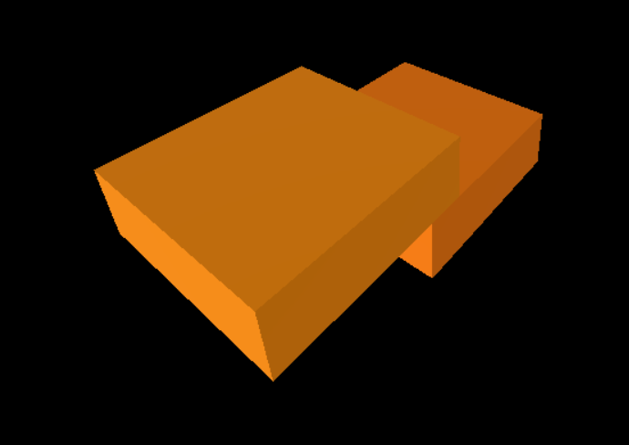

# Skyscraper 🪂

### Description 📑

Skyscraper game is a construction game where you create your own skyscraper. During the game you will build buildings as high as possible.

The goal of the game is to create the tallest skyscraper.
As you progress through the game, you will face various challenges, for example less size block and others.

There will be various rewards and achievements in the game in the future.

### Packages - What's Inside 📦

Skyscraper is a masterpiece of modern web development, employing cutting-edge technologies to bring the skyscraper construction experience to life:

<details>
<summary><b>Three.js</b></summary>
The heart of our game, Three.js powers the stunning 3D graphics that make your skyscraper world come alive.
</details>
<details>
<summary><b>Cannon-es</b></summary>
Behind every block and tower, Cannon-es provides the physics simulation that ensures your skyscraper stands strong.
</details>
<details>
<summary><b>TypeScript</b></summary>
The codebase is built on TypeScript, offering structured and maintainable development.
</details>
<details>
<summary><b>Vite</b></summary>
Our build tool of choice, Vite, makes development swift and efficient, ensuring a seamless gaming experience.
</details>

### Game Example 🎮


Above is a sneak peek of the game in action. You can see how you'll construct your skyscraper, stacking blocks, and reaching for the sky. The game offers a fun and challenging experience that will keep you engaged for hours.

View the live website here: **[Skyscraper](https://skyscraper-game.netlify.app/)**

### How to Contribute 🧑‍💻

We welcome contributors to join our project and help make it even better. Whether you're a developer, designer, or enthusiast, there are many ways to get involved:

- **Bug Reporting**: If you find any issues or bugs, please report them on our [GitHub Issues](https://github.com/corners2wall/Skyscraper/issues) page.

- **Feature Requests**: Have an idea for a cool new feature or improvement? Share it on the [GitHub Issues](https://github.com/corners2wall/Skyscraper/issues) page.

- **Code Contributions**: If you're a developer, feel free to fork the repository, create a new branch, and submit a pull request.

- **Documentation**: Help us improve our documentation to make it more accessible and informative.

- **Testing**: Play the game, test it thoroughly, and provide feedback on your experience.

- **Spread the Word**: Enjoyed playing Skyscraper? Share it with your friends and on social media.

### Stay Connected 🫂

To stay updated with the latest developments, watch for updates on our [GitHub repository](https://github.com/corners2wall/Skyscraper).

Let's build the tallest skyscraper together and have a blast doing it! 🏙️

``` Skyscraper - Build Your Way to the Sky ```



### Acknowledgements 🙏
~~~
Thank you for using and contributing to the Skyscraper Three.js Game 😎 :)
~~~